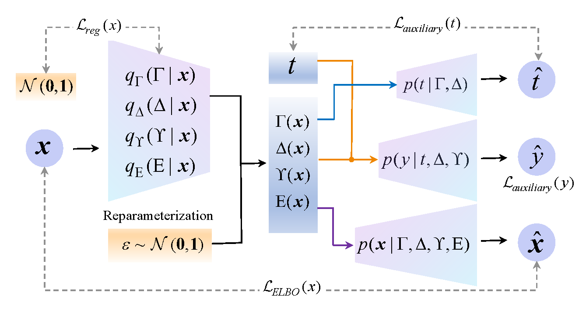
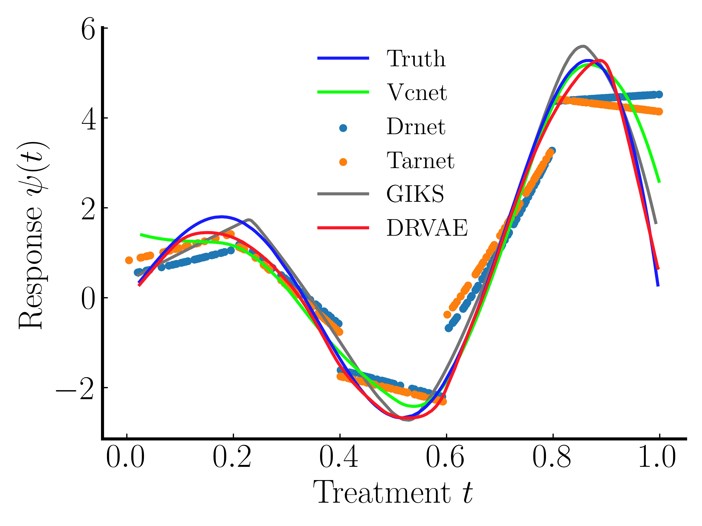
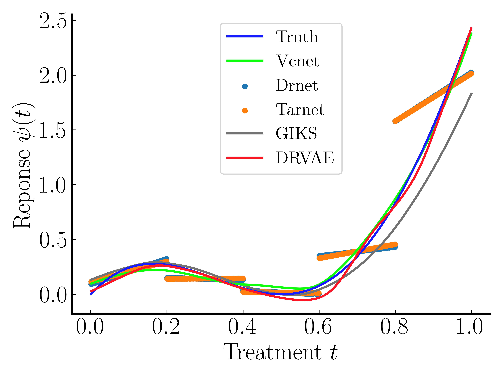

# DRVAE
This is the code for our paper: [Disentangled Representation via Variational AutoEncoder for Continuous Treatment Effect Estimation](https://arxiv.org/pdf/2406.02310)
# Abstract
Continuous treatment effect estimation holds significant practical importance across various decision-making and assessment domains. However, current methods for estimating dose-response curves hinge on balancing the entire representation by treating all covariates as confounding variables. Although various approaches disentangle covariates into different factors for treatment effect estimation, they are confined to binary treatment settings. Moreover, observational data are often tainted with non-causal noise information that is imperceptible to the human. Hence, in this paper, we propose a novel Dose-Response curve estimator via Variational AutoEncoder (DRVAE) disentangled covariates representation. Our model is dedicated to disentangling covariates into instrumental factors, confounding factors, adjustment factors, and external noise factors, thereby facilitating the estimation of treatment effects under continuous settings by balancing the disentangled confounding factors.  Extensive results on synthetic and semi-synthetic datasets demonstrate that our model outperforms the current state-of-the-art methods.

This code is based on VCNet: https://github.com/lushleaf/varying-coefficient-net-with-functional-tr/blob/main/README.md#how-to-run
Datasets are also available there.
# How to run
## Dependencies

The model was implemented in Python 3.8. with pytorch 2.2.2:
- numpy==1.24.3
- pandas==2.0.3
- matplotlib==3.7.5
- torch==2.2.2
## To run the experiment with simulated data:

-- generate simulated data

python simu1_generate_data_withBinNoise.py

-- train and evaluating the methods

python main_simu.py

## Paper plots:
-- We have provided the results that we obtained during our runs.
The data result file is placed in "DRcurve".
All the pictures are in "figures".
The LaTex environment is necessary for reproducing the picture.

python visualize_results.py

-- Bellow is the main DR-curves.
.jpeg)

